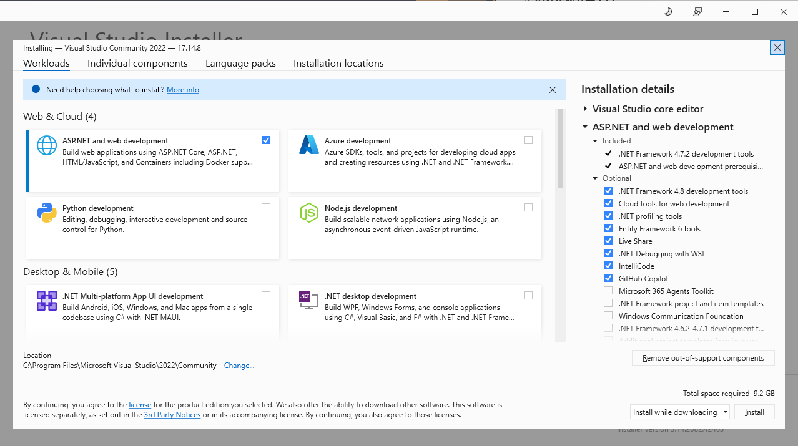

# bill-Payoneer-backend-oa

A RESTful API for managing orders built with .NET 9, Entity Framework Core, and SQLite. This project implements a clean architecture with embedded Product objects stored as JSON within the Orders table.

## 📁 Project Structure

```
bill-Payoneer-backend-oa/
├── OrdersApi.Api/                  # Web API Layer
│   ├── Controller/
│   │   └── OrdersController.cs     # REST API endpoints
│   ├── Program.cs                  # Application entry point
│   ├── appsettings.json           # Configuration
│   └── Properties/
│       └── launchSettings.json    # Debug settings
├── OrdersApi.Core/                 # Business Logic Layer
│   ├── Models/
│   │   ├── Order.cs               # Order entity
│   │   └── Product.cs             # Product value object
│   ├── DataContext/
│   │   └── DatabaseContext.cs     # EF Core DbContext
│   ├── Repositories/
│   │   ├── IOrderRepository.cs    # Repository interface
│   │   └── Concrete/
│   │       └── OrderRepository.cs # Repository implementation
│   ├── Services/
│   │   ├── IOrderService.cs       # Service interface
│   │   └── Concrete/
│   │       └── OrderService.cs    # Service implementation
│   └── Configurations/
│       └── DatabaseSettings.cs    # Database configuration
├── OrdersApi.Tests/               # Unit & Integration Tests
│   ├── Models/                    # Model tests
│   ├── Services/                  # Service tests
│   ├── Repositories/              # Repository tests
│   ├── Controllers/               # Controller tests
│   ├── DataContext/               # DbContext tests
│   ├── Integration/               # Integration tests
│   └── Utilities/                 # Test helpers
├── Shared/
│   └── orders.db                  # SQLite database
└── resources/                     # Documentation assets
```

## 🚀 Quick Start Guide

### Prerequisites

- .NET 9 SDK
- Git
- Visual Studio 2022 or VS Code
- PowerShell (Windows)

### 1. Clone and Setup

```powershell
git clone <repository-url>
cd bill-Payoneer-backend-oa
```

### 2. Development Environment Setup

#### Option A: Automated Setup (Recommended)

Run PowerShell as Administrator and execute:

```powershell
# Set execution policy
Set-ExecutionPolicy Bypass -Scope Process -Force

# Install SQLite tools
$sqliteUrl = "https://sqlite.org/2025/sqlite-tools-win-x64-3500200.zip"
$installPath = "C:\Program Files\sqlite"
$downloadPath = "$env:TEMP\sqlite-tools.zip"
(New-Object System.Net.WebClient).DownloadFile($sqliteUrl, $downloadPath)
Expand-Archive -Path $downloadPath -DestinationPath $installPath
[Environment]::SetEnvironmentVariable("Path", "$env:Path;$installPath", "Machine")

# Verify installations
dotnet --version
git --version
sqlite3 --version

# Install project dependencies
powershell -ExecutionPolicy Bypass -File install-dependencies.ps1
```

#### Option B: Manual Setup

1. **Install Visual Studio 2022 Community Edition**
   

2. **Install NuGet packages manually**:
   ```powershell
   dotnet restore
   ```

### 3. Database Setup

The SQLite database is automatically created when you first run the application. The database file is located at `./Shared/orders.db`.

```powershell
# Create and seed the database
dotnet ef database update --project OrdersApi.Core --startup-project OrdersApi.Api
```

### 4. Run the Application

```powershell
# Navigate to API project
cd OrdersApi.Api

# Run the application
dotnet run
```

The API will be available at:
- HTTP: `http://localhost:5000`
- HTTPS: `https://localhost:5001`
- Swagger UI: `https://localhost:5001/swagger`

## 🧪 Testing the API

### Using Swagger UI

1. Navigate to `https://localhost:5001/swagger`
2. Use the interactive documentation to test endpoints

### Sample API Requests

#### 1. Get All Orders
```http
GET /api/orders
```

#### 2. Get Specific Orders by IDs
```http
GET /api/orders?orderIds=00000000-0000-0000-0000-000000000001&orderIds=00000000-0000-0000-0000-000000000002
```

#### 3. Create New Orders
```http
POST /api/orders
Content-Type: application/json

[
  {
    "customerName": "John Doe",
    "items": [
      {
        "productId": "a1234567-89ab-cdef-0123-456789abcdef",
        "quantity": 2
      },
      {
        "productId": "b1234567-89ab-cdef-0123-456789abcdef",
        "quantity": 1
      }
    ]
  }
]
```

### Using cURL

```powershell
# Get all orders
curl -X GET "https://localhost:5001/api/orders" -H "accept: application/json"

# Create a new order
curl -X POST "https://localhost:5001/api/orders" \
  -H "accept: application/json" \
  -H "Content-Type: application/json" \
  -d '[{
    "customerName": "Jane Smith",
    "items": [
      {
        "productId": "c1234567-89ab-cdef-0123-456789abcdef",
        "quantity": 5
      }
    ]
  }]'
```

## 🧪 Running Tests

```powershell
# Run all tests
dotnet test

# Run tests with coverage
dotnet test --collect:"XPlat Code Coverage"

# Run specific test category
dotnet test --filter "Category=Unit"
dotnet test --filter "Category=Integration"
```

### Database Schema
```sql
Orders Table:
- Id (GUID, Primary Key)
- CustomerName (TEXT, Required)
- Items (TEXT, JSON Array of Products)
- CreatedAt (DATETIME)
```

## 🔧 Configuration

### Database Configuration

The SQLite database (`orders.db`) is stored in the `Shared` folder to:
- Avoid duplication across different environments
- Centralize database management
- Make it easier to backup and share database state

Database path: `./Shared/orders.db`

### JSON Serialization
- Uses Newtonsoft.Json for consistent serialization
- Configured for case-insensitive property matching
- Supports complex object serialization for embedded Products

## 🛠️ Development Tools (Optional but Recommended)

### VS Code Extensions
- C# Dev Kit
- SQLite Viewer
- EF Core Power Tools
- REST Client

### Visual Studio Extensions
- Entity Framework Core Power Tools
- SQLite/SQL Server Compact Toolbox

## 📊 API Documentation

When running the application, detailed API documentation is available at:
- Swagger UI: `/swagger`
- OpenAPI JSON: `/swagger/v1/swagger.json`

## 🚨 Troubleshooting

### Common Issues

1. **Database Connection Issues**
   - Ensure the `Shared` folder exists
   - Check file permissions for `orders.db`

2. **Package Restore Issues**
   ```powershell
   dotnet clean
   dotnet restore
   dotnet build
   ```

3. **Migration Issues**
   ```powershell
   dotnet ef database drop --project OrdersApi.Core --startup-project OrdersApi.Api
   dotnet ef database update --project OrdersApi.Core --startup-project OrdersApi.Api
   ```

## 📝 Contributing

1. Fork the repository
2. Create a feature branch
3. Make your changes
4. Add tests for new functionality
5. Ensure all tests pass
6. Submit a pull request